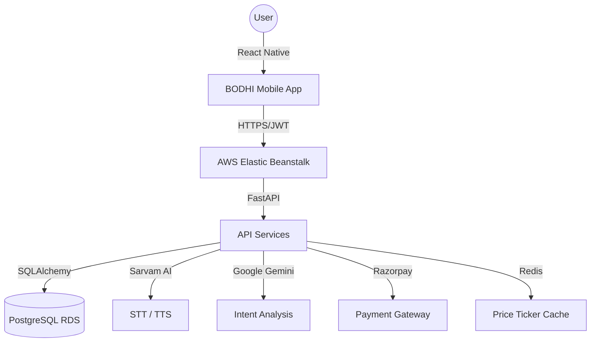

<p align="center">
  
</p>

<p align="center">
  <strong>Your Money. Alive.</strong>
</p>

<p align="center">
  <em>The Financial Immune System for Gen-Z</em>
</p>

<p align="center">
  
  
  
  
  
  
</p>

---

```txt
                                                              
        :::::::::   ::::::::  :::::::::  :::    ::: ::::::::::: 
       :+:    :+: :+:    :+: :+:    :+: :+:    :+:     :+:      
      +:+    +:+ +:+    +:+ +:+    +:+ +:+    +:+     +:+       
     +#++:++#+  +#+    +:+ +#+    +:+ +#++:++#++     +#+        
    +#+    +#+ +#+    +#+ +#+    +#+ +#+    +#+     +#+         
   #+#    #+# #+#    #+# #+#    #+# #+#    #+#     #+#          
  #########   ########  #########  ###    ### ###########       
                                                              
             T H E   F I N A N C I A L   C O C K P I T
```

---

## ⚡ The Problem
Finance apps today are **broken** for the new generation.
*   **Group Friction:** "Who owes what?" ruins trips and friendships.
*   **FOMO Investing:** Blindly following trends without understanding risk.
*   **Insurance Black Holes:** Critical documents remain unread and misunderstood.
*   **Privacy Paranoia:** Fear of data scraping and intrusive credential access.
*   **Functional Fatigue:** Switching between 5 apps just to manage a single weekend getaway.

| Problem | The "BODHI" Impact |
| :--- | :--- |
| **Awkward IOUs** | Real-time shared **Trip Wallets** with automated settlement. |
| **Complex Trading** | **Paper Trading** & **Social Venture Clubs** to learn by doing. |
| **Hidden Clauses** | AI-powered **Insurance Stories** that decode PDFs into simple bits. |
| **Static Data** | A **Live Financial Cockpit** that breathes with your market pulse. |

---

## 🚀 The Solution
BODHI is an all-in-one **Fintech Super App** designed to act as your financial immune system—protecting your wealth, automating your collaborations, and simplifying your decisions.

### 🧠 Core Pillar: The BODHI Brain (GAP)
Our AI Co-pilot, **GAP**, powered by **Gemini 1.5 Flash** and **Sarvam AI**, provides a voice-first interface to your money.
*   **Voice Logging:** "GAP, I just spent ₹500 on Zomato." (Done. Categorized. Synced.)
*   **Natural Language Queries:** "Can I afford a trip to Goa next month?"
*   **Bilingual Mastery:** Seamlessly understands Hindi, English, and Hinglish.

---

## 🛠️ Feature Showcase

### 💎 The Vault (Dashboard)
A premium, glassmorphic "Financial Cockpit" that gives you a 360° view of your net worth, growth metrics, and live market tickers.
*   **Live Pulse:** Real-time asset tracking with pulse indicators.
*   **Quick Actions:** Scan & Pay, Send, and Add money in one fluid glass pill.

### ✈️ Trip Wallets
Collaborative expense tracking for groups. Create a trip, invite friends, and let BODHI handle the math.
*   **Scoped Chat:** Discussion threads tied directly to specific trips.
*   **Polls:** Vote on destinations, hotels, or split logic.

### 🤝 Venture Clubs
Social investing reinvented. Form a club with friends to track shared portfolios or compete in paper trading leagues.

### 📜 Insurance Stories
Upload a complex 50-page insurance PDF and let GAP summarize the "Critical 5" things you actually need to know.

---

## 🏗️ System Architecture

### Enterprise Flow


---

## 💻 Tech Stack

### Frontend
*   **React Native (0.73.4)** — Cross-platform high-performance core.
*   **TypeScript** — Type-safe financial logic.
*   **React Navigation** — Seamless stack & bottom-tab transitions.
*   **Reanimated 3** — 60FPS fluid UI interactions.
*   **Lucide Icons** — Premium minimalist iconography.

### Backend
*   **FastAPI** — High-performance Python framework.
*   **SQLAlchemy / Alembic** — Robust ORM & database migrations.
*   **PostgreSQL (AWS RDS)** — Production-grade relational storage.
*   **Nginx / Gunicorn** — Reliable process management.

### AI & Payments
*   **Google Gemini 1.5 Flash** — Advanced LLM for intent & coaching.
*   **Sarvam AI** — Specialized Indic-language STT and TTS.
*   **Razorpay** — Secure UPI & Card processing.

---

## 📂 Project Structure

```bash
BODHI/
├── mobileApp_BODHI/          # React Native Mobile Application
│   ├── src/
│   │   ├── api/              # Axios clients & API definitions
│   │   ├── components/       # Premium glassmorphic UI components
│   │   ├── context/          # State management (Calculator, Auth)
│   │   ├── data/             # Mock data & static assets
│   │   ├── navigation/       # AppNavigator (Stack & Tab)
│   │   └── screens/          # 20+ Production-ready screens
│   └── assets/               # High-res logos & branding
├── bodhi-backend/            # FastAPI Production Backend
│   ├── routers/              # 18+ Scoped API routers
│   ├── models/               # SQLAlchemy DB Schemas
│   ├── services/             # AI, Payment, & Auth Logic
│   ├── alembic/              # Database migration history
│   └── main.py               # App entry & middleware
└── README.md                 # Project Documentation
```

---

## 📡 API Reference (Deployed)

**Base URL:** `http://bodhi-env.eba-at8qpmww.ap-south-1.elasticbeanstalk.com`
**Swagger UI:** [/docs](http://bodhi-env.eba-at8qpmww.ap-south-1.elasticbeanstalk.com/docs)

| Category | Method | Endpoint | Description |
| :--- | :--- | :--- | :--- |
| **Health** | `GET` | `/` | Service status check |
| **Auth** | `POST` | `/auth/token` | JWT Token generation |
| **AI** | `POST` | `/ai/command` | Unified Voice -> Intent -> Action |
| **Trade** | `GET` | `/trade/portfolio` | User holdings & P/L |
| **Social** | `GET` | `/social/clubs` | Venture Club listing |
| **Travel** | `POST` | `/travel/flights/search` | Real-time flight discovery |
| **Payments** | `POST` | `/payments/verify` | Razorpay signature validation |

---

## ⚙️ Local Setup

### 1. Prerequisites
*   Node.js (v18+)
*   Python 3.10+
*   PostgreSQL (Local or RDS)
*   CocoaPods (for iOS)

### 2. Backend Setup
```bash
cd bodhi-backend
python -m venv venv
source venv/bin/activate  # Windows: venv\Scripts\activate
pip install -r requirements.txt
# Configure .env with your GEMINI_API_KEY and RAZORPAY_KEY
uvicorn main:app --reload --host 0.0.0.0 --port 8000
```

### 3. Mobile Setup
```bash
cd mobileApp_BODHI
npm install --legacy-peer-deps
npx pod-install # iOS only
npm run ios # or npm run android
```

---

## 🔒 Security & Privacy
*   **JWT Authentication:** All API calls are secured with industry-standard JSON Web Tokens.
*   **Zero-Knowledge Transfers:** Payments are handled via Razorpay SDKs; we never store raw card/UPI credentials.
*   **Independently Scalable:** Backend is micro-serviced into routers, allowing specialized scaling for AI vs Transactional loads.

---

## 🗺️ Roadmap
- [x] **Phase 1:** Core Wallet & QR Payments (Razorpay Integration)
- [x] **Phase 2:** AI Voice Logging & Indic-language STT
- [x] **Phase 3:** Social Venture Clubs & Trip Wallets
- [ ] **Phase 4:** Open Banking (Account Aggregator) Integration
- [ ] **Phase 5:** Predictive Wealth Forecasting (LSTM Models)

---

## 👥 The Team
**Team BUGHACKERS 404**
*   **Govind Jindal** — Full-stack Architecture & Integration
*   **Aaradhya Khanna** — AI Strategy & RAG Implementation
*   **Piyush Sharma** — Security, Notifications & Core Logic

---

## 📄 License
Built with 🧠 and way too much caffeine for the **FINVASIA Innovation Hackathon 2026**.

<p align="center">
  <em>BODHI — Your money. Alive.</em>
</p>
